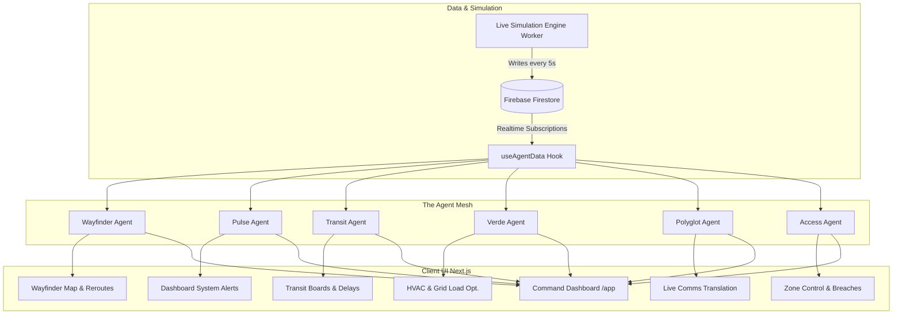

# Concourse

**The AI Operating System for the FIFA World Cup 2026 Stadium Experience**

Concourse is a multi-agent nervous system for a stadium. Instead of a standard chatbot, Concourse orchestrates specialized AI agents that own individual verticals (navigation, crowd management, transit, sustainability, accessibility, and multilingual translation). These agents share a real-time data plane, correlate with each other's findings before speaking to a human, and provide transparent "Reasoning Trails" for every decision.

---

## 1. Problem Statement

> **[Challenge 4] Smart Stadiums & Tournament Operations**
> Build a GenAI-enabled solution that enhances stadium operations and the overall tournament experience for fans, organizers, volunteers, or venue staff. 

Most solutions approach this by building a single chatbot. Concourse approaches this by treating the stadium as a live, pulsing entity. We cover navigation, crowd management, accessibility, transportation, sustainability, and multilingual assistance through operational intelligence and real-time decision support as *emergent properties* of how the agents talk to each other.

---

## 2. Solution: The Concourse Agent Mesh

Concourse utilizes six distinct AI Agents, orchestrated through Genkit and powered by Gemini 2.5 Flash & Pro.

1. **Wayfinder** — Dynamic crowd flow and spatial optimization routing. Reads live density from Pulse before proposing a route.
2. **Pulse** — Venue health and capacity monitoring. Owns the Live Simulation Engine and forecasting.
3. **Transit** — External logistics, arrivals tracking, and public transport sync.
4. **Verde** — Sustainability and energy management, tracking live carbon footprint and grid draw.
5. **Polyglot** — Instant multi-lingual translation for global fan bases and staff radios.
6. **Access** — Credentialing, biometric ticketing, and security zone control.

### The "Reasoning Trail"
Concourse doesn't just give commands; it shows its work. Every agent response in the UI features an expandable "Reasoning Trail" detailing the exact data read, the timestamps, and the intermediate reasoning before the final recommendation. This ensures transparency, prevents black-box AI decisions, and establishes trust.

---

## 3. Architecture Diagram



---

## 4. Project Structure Diagram

```text
concourse/
├── public/                 # Static assets and images
│   └── images/
├── scripts/
│   └── simulation-worker.ts # Node.js script simulating live stadium data & agent logic
├── src/
│   ├── app/
│   │   ├── app/            # Command Dashboard and Agent Pages
│   │   │   ├── access/     # Access Agent Screen
│   │   │   ├── polyglot/   # Polyglot Agent Screen
│   │   │   ├── pulse/      # Pulse Agent Screen
│   │   │   ├── transit/    # Transit Agent Screen
│   │   │   ├── verde/      # Verde Agent Screen
│   │   │   ├── wayfinder/  # Wayfinder Agent Screen
│   │   │   └── page.tsx    # Main Command Center Dashboard
│   │   ├── page.tsx        # Public Landing Page
│   │   ├── layout.tsx
│   │   └── globals.css     # Design tokens and tailwind imports
│   ├── components/         # Reusable React components (Sidebar, AppShell)
│   └── hooks/
│       └── useAgentData.ts # Global hook subscribing to Firebase Firestore
├── package.json
├── tailwind.config.ts
└── tsconfig.json
```

---

## 5. UI Flow and Workflow Explanation

1. **Landing Page:** The user is greeted by a high-conversion, dynamic landing page explaining the Concourse platform, featuring the 6 agent modules and a live-simulated marquee.
2. **Command Dashboard (`/app`):** The central nervous system. The user views the high-level health of the stadium. If the Pulse agent detects a spike in occupancy, the dashboard instantly flags a "SYSTEM ALERT".
3. **Cross-Agent Ripple Effect:** When an alert is triggered in Pulse, Wayfinder immediately flags an "ACTIVE REROUTE" to divert traffic, and Access updates its breach detection. All of this is pushed to the UI in real-time.
4. **Agent Deep-Dives:** The user can click into any agent (e.g., `/app/wayfinder`) to see the granular, live-updating Reasoning Trail (the exact log sequence of how the AI identified the anomaly and resolved it).

---

## 6. How to Setup the Environment

### Prerequisites
- Node.js (v18+)
- Firebase Account (for Firestore)

### Installation
1. Clone the repository:
   ```bash
   git clone https://github.com/Dineshkumar2006471/concourse.git
   cd concourse
   ```
2. Install dependencies:
   ```bash
   npm install
   ```
3. Set up environment variables:
   Create a `.env.local` file in the root directory and add your Firebase credentials:
   ```env
   NEXT_PUBLIC_FIREBASE_PROJECT_ID=your-project-id
   NEXT_PUBLIC_FIREBASE_APP_ID=your-app-id
   NEXT_PUBLIC_FIREBASE_STORAGE_BUCKET=your-storage-bucket
   NEXT_PUBLIC_FIREBASE_API_KEY=your-api-key
   NEXT_PUBLIC_FIREBASE_AUTH_DOMAIN=your-auth-domain
   NEXT_PUBLIC_FIREBASE_MESSAGING_SENDER_ID=your-sender-id
   ```

### Running the Application

1. **Start the Live Simulation Worker:**
   This script drives the real-time data for the agents. Keep this running in a separate terminal.
   ```bash
   npx tsx scripts/simulation-worker.ts
   ```
2. **Start the Next.js Development Server:**
   ```bash
   npm run dev
   ```
3. Open `http://localhost:3000` in your browser.

---

## 7. License

This project is licensed under the MIT License - see the [LICENSE](LICENSE) file for details.
