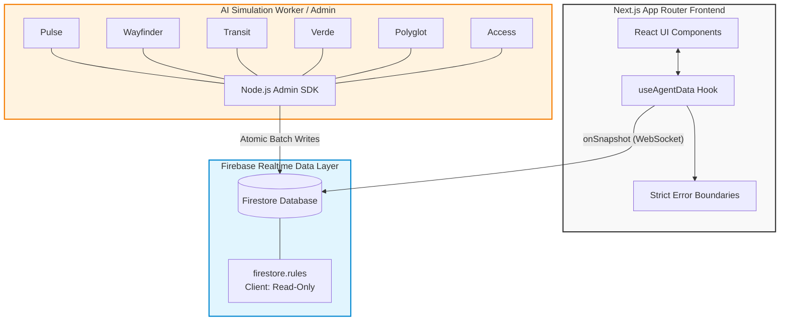

<div align="center">
  
  <h1>Concourse: AI Venue Command Center</h1>
  <p><em>Real-time, multi-agent simulation and logistics dashboard for mega-venue management.</em></p>

  [](https://github.com/Dineshkumar2006471/concourse/actions/workflows/ci.yml)
  [](https://nextjs.org/)
  [](https://www.typescriptlang.org/)
  [](https://firebase.google.com/)
  []()
</div>

---

## 📖 Table of Contents
- [Project Overview](#-project-overview)
- [System Architecture](#-system-architecture)
- [The 6 AI Agents](#-the-6-ai-agents)
- [Tech Stack](#-tech-stack)
- [Enterprise Standards (Security & A11y)](#-enterprise-standards-security--a11y)
- [Getting Started](#-getting-started)
- [Testing & Quality Gates](#-testing--quality-gates)

---

## 🎯 Project Overview

**Concourse** is a prototype AI-driven command center designed for mega-venues (like stadiums hosting the FIFA World Cup). It replaces traditional, fragmented operational dashboards with a unified, real-time interface powered by **six specialized AI agent models**. 

The system continuously simulates live venue data—ranging from crowd density and transit logistics to multi-lingual translations and power consumption—streaming it directly to the Next.js frontend via Firebase WebSockets.

---

## 🏗 System Architecture

The architecture decouples the high-frequency AI simulation data generation from the client UI presentation layer, ensuring high performance and security.



---

## 🤖 The 6 AI Agents

Concourse simulates the intelligence of six distinct operational areas:

1. **Pulse (Venue Health):** Monitors active incidents, total stadium occupancy, and crowd flow rates, triggering localized UI hotspots when thresholds are breached.
2. **Wayfinder (Spatial Routing):** Dynamically reroutes crowd flow away from congested gates to maintain physical capacity limits.
3. **Transit (Logistics):** Tracks inbound logistics, managing ETAs and capacities for trains and buses connecting to the venue.
4. **Verde (Sustainability):** Analyzes grid power draw and potable water usage, outputting actionable AI recommendations to reduce carbon footprints.
5. **Polyglot (Translation):** Listens to live audio feeds and broadcasts automated, multi-lingual translations to relevant international fan sectors.
6. **Access (Security):** Monitors credential scans, detecting VIP movements and flagging unauthorized zone breaches with detailed reasoning trails.

---

## 💻 Tech Stack

| Domain | Technology | Description |
|---|---|---|
| **Frontend Framework** | `Next.js 15` (App Router) | React framework utilizing Server and Client Components. |
| **Styling** | `Tailwind CSS` | Utility-first CSS framework mapped to custom design tokens. |
| **Icons & Assets** | `Material Symbols` | Google's variable icon font (`outlined` variant). |
| **Realtime DB** | `Firebase Firestore` | NoSQL document database providing WebSocket `onSnapshot` listeners. |
| **Backend Worker** | `Node.js` + `firebase-admin`| Headless worker simulating AI data streams via atomic batches. |
| **Testing** | `Vitest` + `RTL` | High-speed unit and component testing. |
| **Linting** | `ESLint` + `jsx-a11y` | Strict static analysis enforcing code purity and accessibility. |

---

## 🛡 Enterprise Standards (Security & A11y)

This prototype has been heavily audited to meet strict production-grade standards:

- **Accessibility (A11y):** Achieves near-perfect semantic compliance. Implements `role="main"` landmarks, `aria-live` regions for critical alerts, and explicit `aria-label` tags for all icon-only buttons. Enforced continuously in CI via `eslint-plugin-jsx-a11y`.
- **Fault Tolerance:** Global and Route-Segment Error Boundaries (`error.tsx`, `global-error.tsx`) prevent UI crashes. The centralized `useAgentData` hook manages connection state machines and stale-data detection.
- **Security:** Clients are blocked from writing to the database via strict `firestore.rules`. All strings injected into the UI pass through a robust XSS sanitizer (`sanitize.ts`).
- **Data Integrity:** Strict TypeScript interfaces and runtime schema parsers (`src/types/firestore.ts`) ensure the UI never faults on malformed payloads.

---

## 🚀 Getting Started

### Prerequisites
- Node.js `22.x` or higher
- A Firebase project with Firestore enabled.

### 1. Installation
```bash
git clone https://github.com/Dineshkumar2006471/concourse.git
cd concourse
npm install
```

### 2. Environment Variables
Create a `.env.local` file in the root directory:
```env
NEXT_PUBLIC_FIREBASE_API_KEY="your-api-key"
NEXT_PUBLIC_FIREBASE_AUTH_DOMAIN="your-domain"
NEXT_PUBLIC_FIREBASE_PROJECT_ID="your-project-id"
```

*Note: For the backend simulation worker, you must place your Firebase Admin Service Account JSON at `firebase-service-account.json`.*

### 3. Running the Stack
You need two terminal windows to run the full simulation.

**Terminal 1 (Frontend):**
```bash
npm run dev
```

**Terminal 2 (AI Simulation Worker):**
```bash
npx tsx scripts/simulation-worker.ts
```

---

## 🧪 Testing & Quality Gates

This repository enforces strict CI/CD quality gates. You can run validations locally:

```bash
# 1. Run strict TypeScript compiler check (no emitting)
npx tsc --noEmit

# 2. Run ESLint (including accessibility rules)
npm run lint

# 3. Run the Vitest test suite
npm run test
```

A production build will only succeed if all linting, type-checking, and tests pass.

---
<div align="center">
  <p>Built for the future of mega-event operations.</p>
</div>
