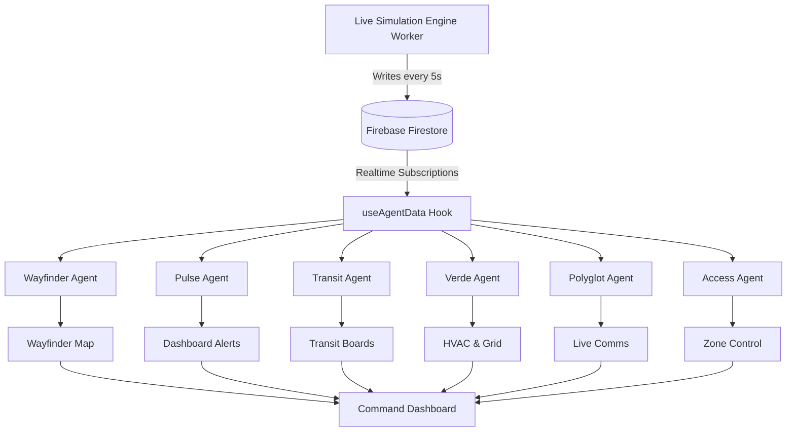

<div align="center">
  

  # Concourse

  **The AI Operating System for the FIFA World Cup 2026 Stadium Experience**

  [](https://opensource.org/licenses/MIT)
  []()
  []()
  []()
  []()

  *Concourse transforms stadium operations from static dashboards into a fully autonomous, real-time nervous system powered by a swarm of specialized AI agents.*
</div>

---

## 📑 Table of Contents
- [Problem Statement](#-problem-statement)
- [Solution: The Concourse Agent Mesh](#-solution-the-concourse-agent-mesh)
- [Architecture & Tech Stack](#-architecture--tech-stack)
- [Features & Workflow](#-features--workflow)
- [Project Structure](#-project-structure)
- [Environment Setup](#-environment-setup)
- [License](#-license)

---

## 🎯 Problem Statement

> **[Challenge 4] Smart Stadiums & Tournament Operations**  
> Build a GenAI-enabled solution that enhances stadium operations and the overall tournament experience for fans, organizers, volunteers, or venue staff.

Most solutions approach this by building a single chatbot. Concourse approaches this by treating the stadium as a live, pulsing entity. We cover navigation, crowd management, accessibility, transportation, sustainability, and multilingual assistance through operational intelligence and real-time decision support as *emergent properties* of how the agents talk to each other.

---

## 🧠 Solution: The Concourse Agent Mesh

Concourse utilizes six distinct AI Agents, orchestrated through Genkit and powered by Gemini 2.5 Flash & Pro.

1. **Wayfinder** — Dynamic crowd flow and spatial optimization routing. Reads live density from Pulse before proposing a route.
2. **Pulse** — Venue health and capacity monitoring. Owns the Live Simulation Engine and forecasting.
3. **Transit** — External logistics, arrivals tracking, and public transport sync.
4. **Verde** — Sustainability and energy management, tracking live carbon footprint and grid draw.
5. **Polyglot** — Instant multi-lingual translation for global fan bases and staff radios.
6. **Access** — Credentialing, biometric ticketing, and security zone control.

### The "Reasoning Trail"
Concourse doesn't just give commands; it shows its work. Every agent response in the UI features an expandable **Reasoning Trail** detailing the exact data read, the timestamps, and the intermediate reasoning before the final recommendation. This ensures transparency, prevents black-box AI decisions, and establishes trust.

---

## 🏗️ Architecture & Tech Stack

Concourse is built on a modern, real-time technology stack designed to handle live data streams with zero polling:

### Core Technologies
- **Frontend:** Next.js 14+ (App Router) & React. Provides a fast, responsive UI with file-based routing.
- **Styling:** Tailwind CSS. Custom, high-contrast dark mode aesthetic tailored for a stadium command center.
- **Real-Time Data Plane:** Firebase Firestore. Serves as the central nervous system. WebSockets push updates instantly to the React frontend via the `useAgentData` hook.
- **Simulation Engine:** Node.js & TypeScript Worker. A background worker (`scripts/simulation-worker.ts`) ticking every 5 seconds to generate realistic queueing math and synthetic alerts.
- **AI Orchestration:** Gemini 2.5 Flash & Pro (via Genkit). Powers the agent logic and generates the structured "Reasoning Trails".

### Data Flow Diagram



---

## ⚡ Features & Workflow

1. **Landing Page:** A dynamic landing page explaining the platform, featuring the 6 agent modules and a live-simulated marquee.
2. **Command Dashboard (`/app`):** The central nervous system. Provides high-level health of the stadium. Automatically flags "SYSTEM ALERT" if spikes (e.g., occupancy) are detected.
3. **Cross-Agent Ripple Effect:** Alerts trigger reactions across agents. An alert in Pulse causes Wayfinder to flag an "ACTIVE REROUTE" and Access to update breach detection—all pushed in real-time.
4. **Agent Deep-Dives:** Granular, live-updating Reasoning Trails inside each agent's dedicated screen, showing exactly how the AI identified an anomaly and resolved it.

---

## 📁 Project Structure

```text
concourse/
├── public/                 # Static assets and images
│   └── images/
├── scripts/
│   └── simulation-worker.ts # Node.js script simulating live stadium data
├── src/
│   ├── app/
│   │   ├── app/            # Command Dashboard and Agent Pages
│   │   │   ├── access/     # Access Agent Screen
│   │   │   ├── polyglot/   # Polyglot Agent Screen
│   │   │   ├── pulse/      # Pulse Agent Screen
│   │   │   ├── transit/    # Transit Agent Screen
│   │   │   ├── verde/      # Verde Agent Screen
│   │   │   ├── wayfinder/  # Wayfinder Agent Screen
│   │   │   └── page.tsx    # Main Command Center Dashboard
│   │   ├── page.tsx        # Public Landing Page
│   │   ├── layout.tsx
│   │   └── globals.css     # Design tokens and tailwind imports
│   ├── components/         # Reusable React components (Sidebar, AppShell)
│   └── hooks/
│       └── useAgentData.ts # Global hook subscribing to Firebase Firestore
├── package.json
├── tailwind.config.ts
└── tsconfig.json
```

---

## ⚙️ Environment Setup

### Prerequisites
- Node.js (v18+)
- Firebase Account (for Firestore)

### Installation

1. **Clone the repository**
   ```bash
   git clone https://github.com/Dineshkumar2006471/concourse.git
   cd concourse
   ```

2. **Install dependencies**
   ```bash
   npm install
   ```

3. **Configure Environment Variables**
   Create a `.env.local` file in the root directory:
   ```env
   NEXT_PUBLIC_FIREBASE_PROJECT_ID=your-project-id
   NEXT_PUBLIC_FIREBASE_APP_ID=your-app-id
   NEXT_PUBLIC_FIREBASE_STORAGE_BUCKET=your-storage-bucket
   NEXT_PUBLIC_FIREBASE_API_KEY=your-api-key
   NEXT_PUBLIC_FIREBASE_AUTH_DOMAIN=your-auth-domain
   NEXT_PUBLIC_FIREBASE_MESSAGING_SENDER_ID=your-sender-id
   ```

### Running the Application

1. **Start the Live Simulation Worker**
   Run the background process to generate real-time metrics:
   ```bash
   npx tsx scripts/simulation-worker.ts
   ```

2. **Start the Next.js Dev Server**
   ```bash
   npm run dev
   ```

3. **Open the App**
   Navigate to `http://localhost:3000` in your browser.

---

## 📜 License

This project is licensed under the MIT License - see the [LICENSE](LICENSE) file for details.
